# Overview
Movie Actors App is an application that provides a user registration and
authentication system. Registered/authenticated users will have the ability
to add, edit and delete their favourite movie actors. And for every added actor,
they will have the ability to add, edit and delete their favourite movies whose
that actor is the author. Be aware that "edit" and "delete" options are only
available to owners. Two more options will be added later on, in order to watch
the movie trailers and write a post for a given movie. Those two options will be
available for any authenticated user. Non authenticated users will only be able
to see a list of added actors and their movies.

This app is built as part of **Item Catalog Application** project. In this case,
actors represent categories and movies are the items within each category.

## Project Organization
Project Plan
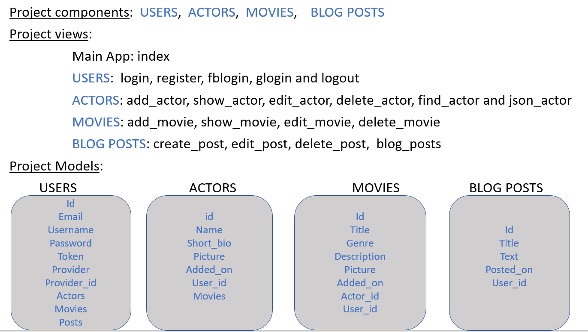

Code Structure
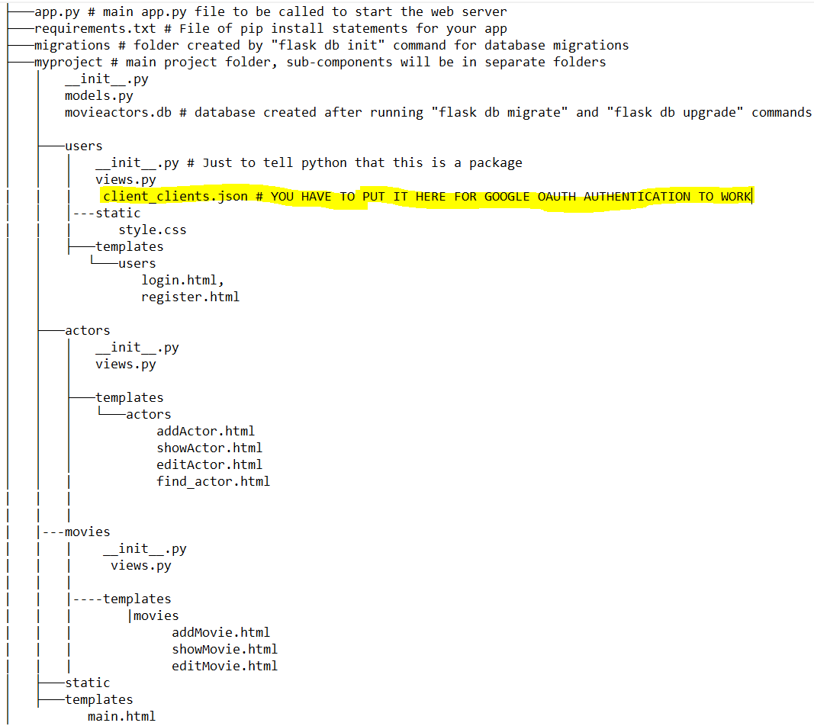

## Preview
In this project, the homepage displays all current categories (5 actors/page).
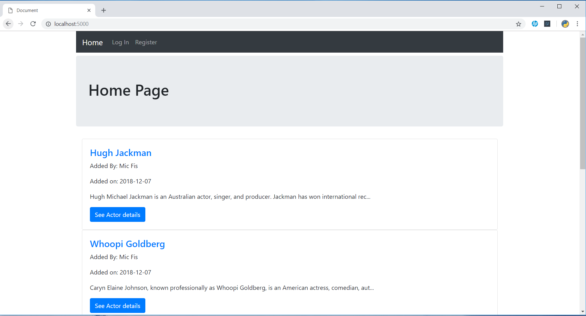

Selecting a specific actor shows you all the movies available for that actor.
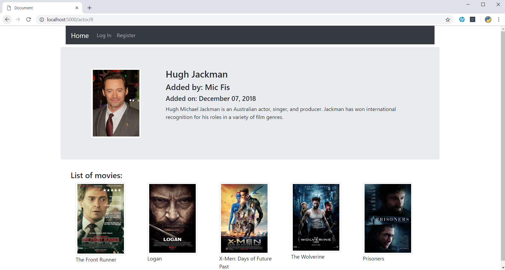

Login page
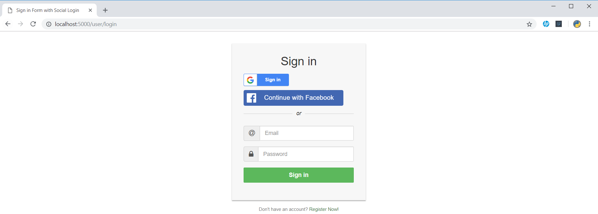

After logging in, a user has the ability to add, update, or delete actors and movies.
He'll be able to watch movie trailers and write a post later on.
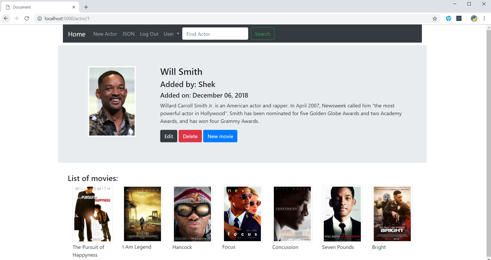

Selecting an item
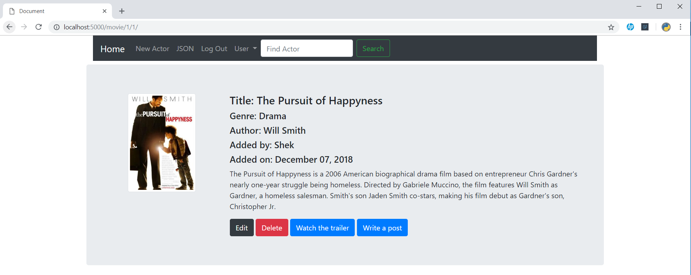
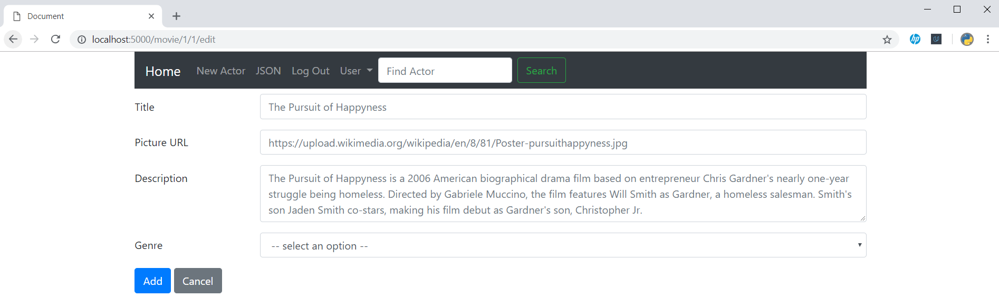
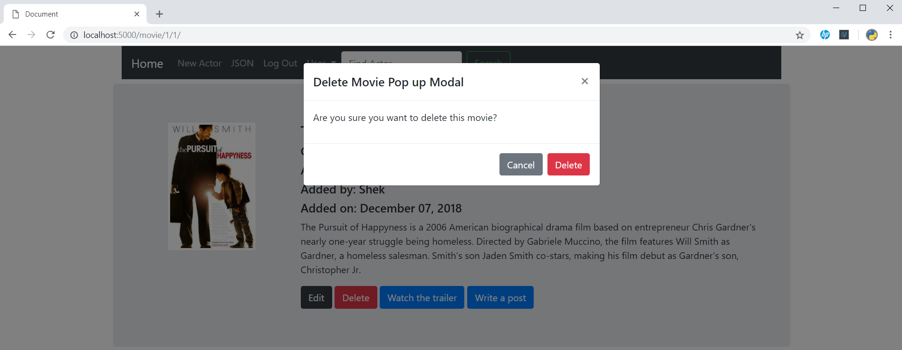

Using search box to find an actor.
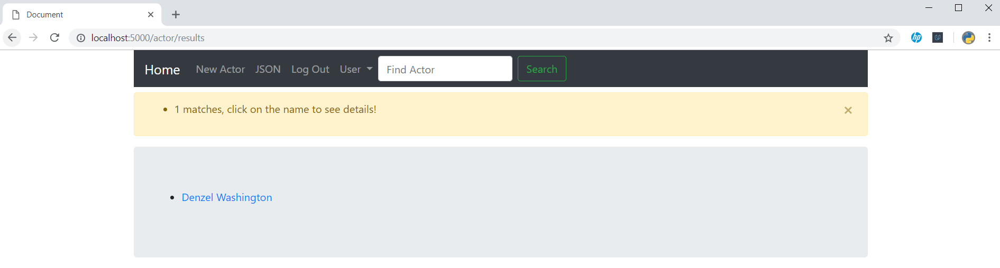

The application provides a JSON endpoint.
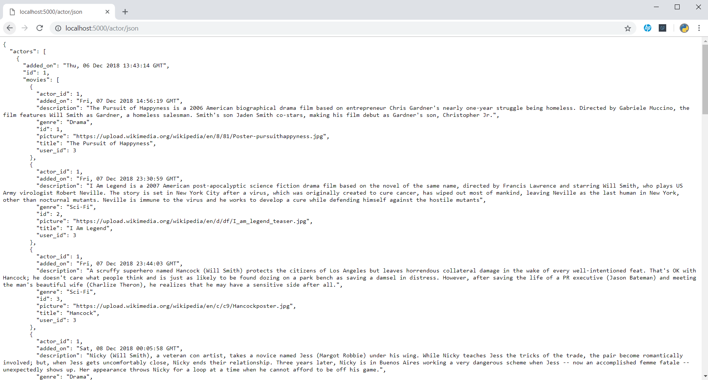

## Technologies
In order to provide you all these features, we'll be using some technologies:
* **Python** : the main programming language for backend side.
* **Flask** : python framework to handle the server side.
* **Flask-Login** : to deal with user registration and authentication.
* **Oauth2client** : to implement third-party OAuth authentication.
* **Flask-SQLAlchemy** : an extension for Flask that adds support for SQLAlchemy.
Where SQLAlchemy is a common database abstraction layer and object relational
mapper. It will be used for persistent data storage in order to perform CRUD
operations: _creating, reading, updating and deleting data_.
* **Flask-Migrate** : for database migration.
* **HTML, CSS, BOOTSTRAP, JAVASCIPT** : for frontend side.

## Tools
To achieve this work, we need some tools:
* [**Virtualbox**](https://www.virtualbox.org/wiki/Downloads) : to provide
virtualization technology.
* [**Vagrant**](https://www.vagrantup.com/downloads.html) : to build virtual
machines that you can easily access from your host machine and also that you
can share with your colleagues.
* **Terminal** or [**Git**](https://git-scm.com/downloads) (Windows users) : to
run command lines.

## Quickstart
To run this application we have two methods: using vagrant machine (recommended)
or creating a python virtual environment.

#### Vagrant machine:
For this method, make sure you have the tools above already installed. Then open
your Terminal and the following command lines:

`$ mkdir CatalogApp` to create a new directory and put in the **'Vagrantfile'**
file, next type

`$ vagrant up` to start building a new vagrant machine, this will take some time.
After successfully building the vagrant machine. You can access it by typing:

```
$ vagrant ssh
Welcome to Ubuntu 18.04.1 LTS (GNU/Linux 4.15.0-29-generic x86_64)

 * Documentation:  https://help.ubuntu.com
 * Management:     https://landscape.canonical.com
 * Support:        https://ubuntu.com/advantage

  System information as of Mon Dec 17 09:52:04 UTC 2018

  System load:  0.02              Processes:           92
  Usage of /:   2.8% of 61.80GB   Users logged in:     1
  Memory usage: 14%               IP address for eth0: 10.0.2.15
  Swap usage:   0%


0 packages can be updated.
0 updates are security updates.


Last login: Mon Dec 17 09:49:48 2018 from 10.0.2.2
vagrant@vagrant:~$ cd /vagrant
vagrant@vagrant:/vagrant$ ls
Vagrantfile
vagrant@vagrant:/vagrant$
```
You can check that the vagrant machine has all the requirements to run this
application:
```
vagrant@vagrant:/vagrant$ python3
Python 3.6.7 (default, Oct 22 2018, 11:32:17)
[GCC 8.2.0] on linux
Type "help", "copyright", "credits" or "license" for more information.
>>>
[1]+  Stopped                 python3
vagrant@vagrant:/vagrant$ which python3
/usr/bin/python3
vagrant@vagrant:/vagrant$
```
```
vagrant@vagrant:/vagrant$ pip3 freeze
alembic==1.0.5
asn1crypto==0.24.0
attrs==17.4.0
Automat==0.6.0
certifi==2018.1.18
chardet==3.0.4
click==6.7
colorama==0.3.7
configobj==5.0.6
constantly==15.1.0
cryptography==2.1.4
distro-info==0.18
Flask==1.0.2
Flask-Login==0.4.1
Flask-Migrate==2.3.1
Flask-SQLAlchemy==2.3.2
httplib2==0.9.2
hyperlink==17.3.1
idna==2.6
incremental==16.10.1
itsdangerous==1.1.0
Jinja2==2.10
keyring==10.6.0
keyrings.alt==3.0
language-selector==0.1
Mako==1.0.7
MarkupSafe==1.1.0
netifaces==0.10.4
oauth2client==4.1.3
PAM==0.4.2
pyasn1==0.4.2
pyasn1-modules==0.2.1
pycrypto==2.6.1
pygobject==3.26.1
pyOpenSSL==17.5.0
pyserial==3.4
python-apt==1.6.3
python-dateutil==2.7.5
python-debian==0.1.32
python-editor==1.0.3
pyxdg==0.25
PyYAML==3.12
requests==2.18.4
requests-unixsocket==0.1.5
rsa==4.0
SecretStorage==2.3.1
service-identity==16.0.0
six==1.11.0
SQLAlchemy==1.2.15
ssh-import-id==5.7
systemd-python==234
Twisted==17.9.0
ufw==0.35
urllib3==1.22
Werkzeug==0.14.1
zope.interface==4.3.2
vagrant@vagrant:/vagrant$
```
Now you are inside your vagrant machine that meet all requirements and you can
share files between guest and host machine, you are ready for the next steps.

But before going further, let's see how to get ready with the second method.

#### Python virtual environment:
The module used to create and manage virtual environments is called
[**venv**](https://docs.python.org/3/tutorial/venv.html).
For windows users it comes along with your python3 but for ubuntu user you may
need to install it first by running the following command line:

`$ sudo apt-get install python3-venv` then type `y` to continue
```
The following NEW packages will be installed
  python3-venv python3.6-venv
0 to upgrade, 2 to newly install, 0 to remove and 0 not to upgrade.
Need to get 7,392 B of archives.
After this operation, 44.0 kB of additional disk space will be used.
Do you want to continue? [Y/n] y
```
When it's done you can now create your virtual environment:
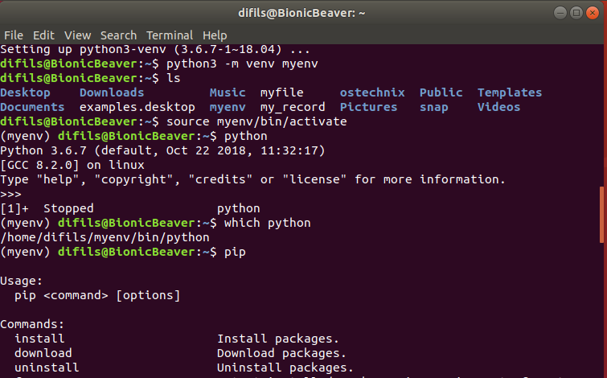

myenv is a new directory containing your virtual environment that you can activate
with the `source myenv/bin/activate` for Linux users or `myenv\Scripts\activate.bat`
for Windows users.
Inside your virtual environment you don't need to specify python3 anymore. But
you need to install the requirements. Make a new directory CatalogApp and put in
`app.py`, `requirements.txt` and 'myproject' folder.

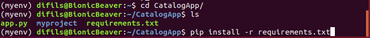
You can choose either 2 methods. So for the next steps we'll be using the vagrant
machine.

Before running the webserver we need to get ready for database migration. This
is where **Flask-Migrate** comes into the picture. We need 3 command lines:
* `flask db init` : to get ready for database migration, this will create migration folder.
* `flask db migrate` : to create tables we defined in _models.py_ file.
* `flask db upgrade` : to actually commit these changes into the database, this
will create the _movieactors.db_ file in myproject folder.

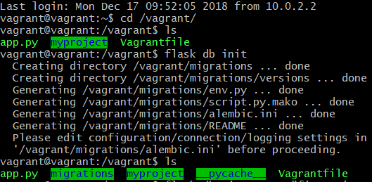
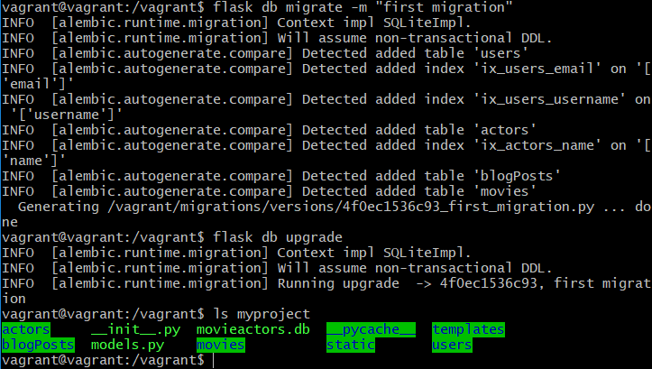

Then run the server and access it via your browser.
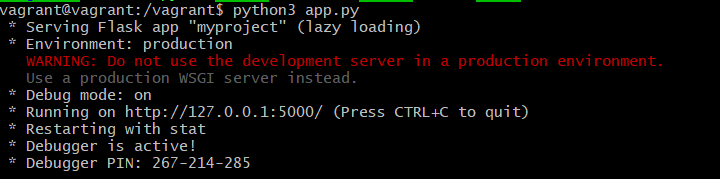

You should have this page:
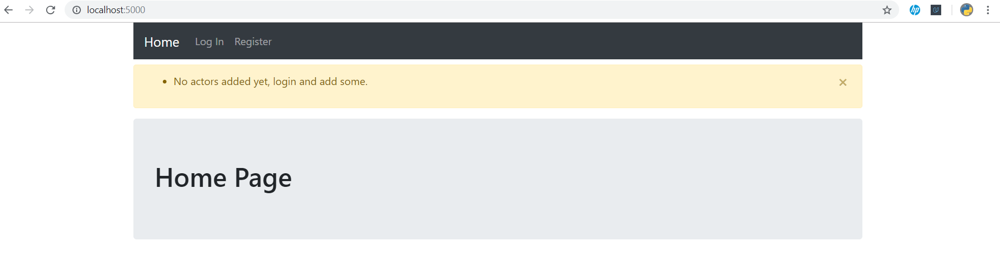

To finish do not forget to put your google CLIENT ID  and facebook APP ID  in myproject/users/templates/users/login.html file.
